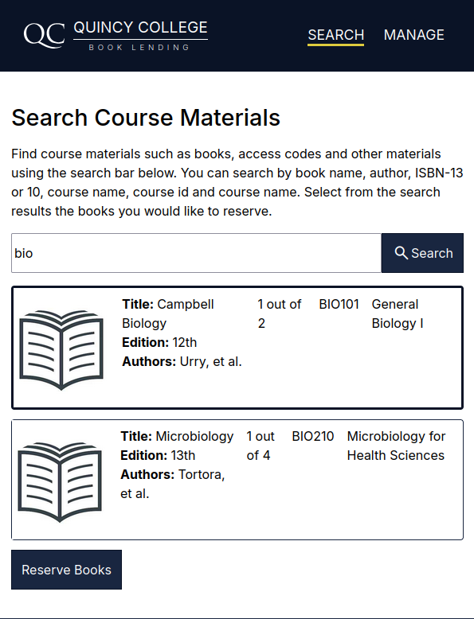
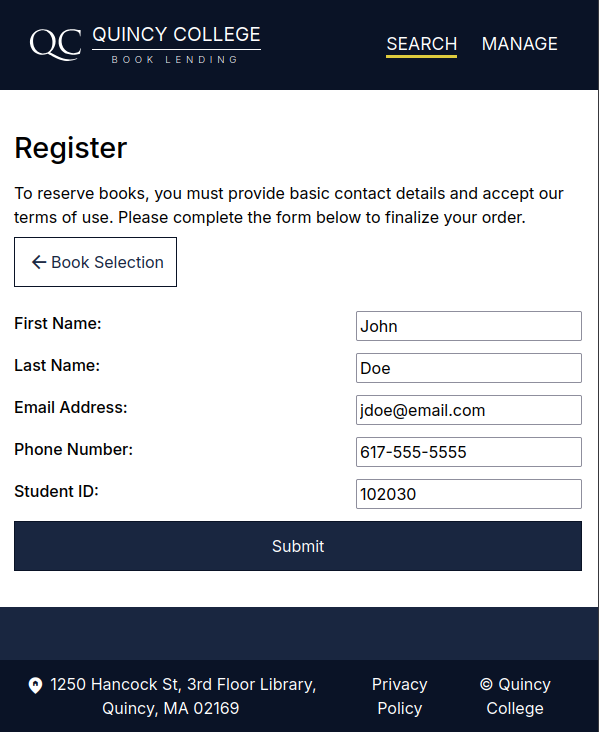
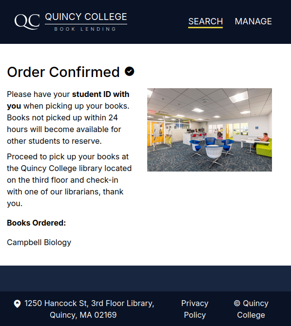
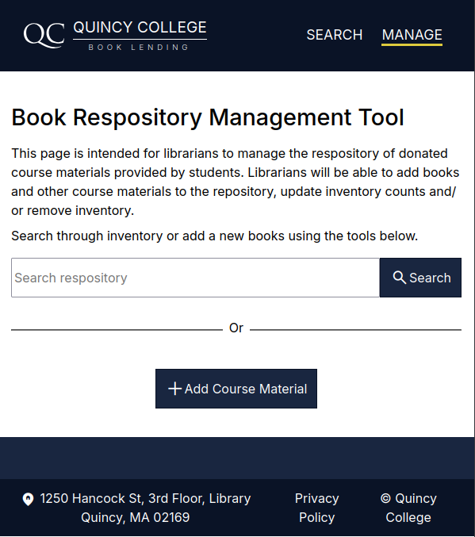

# Quincy College Book Lending Platform
An online internal platform for students looking to temporarily reserve books required by courses. The books come from a repository of books and other course materials donated to the Quincy College library by other students. Given that the books required by courses do not change often, students who have taken the course before and do not have an use for them can contribute to this repository. This platform allows the library to manage this repository and for students unable to purchase books (any reason) access to such resources. Additionally, this platform can easily be embeded into the existing online library portal and encourage more students to donate their used books. Use of the management portion of the platform is reserved for librarians to manage the repository of books such as add new books, update quantities and view active reservations. The reservation portion of the platform is intended for students and has been **implemented as a single page application** (SAP).

# Search Phase
A student begins by searching for their desired book at the search phase of the application. A student can search by book name, author, ISBN-13 or 10, course name, course id and/or course name. Book results appear below the search bar and each book is displayed in a "selectable" card that allows a student to make their selection. Once a student has made their selection, they must press the "Reserve Books" button to continue to the next phase. 

# Registration Phase
Once a student has made their book selections they arrive at the registration phase of the application. In this phase, basic student details are captured such as their full name, phone number, email address and their student id number. All fields are required, the basic contact information is used to send email and text reminders about when to return books to ensure books become avaialble at the end of the semester for other students. No account is created for a student therefore no password is needed, instead, a "reservation" is created for the student using their student ID number as the unique identifier. A student must press "Submit" to complete the registration and upon success is taken to the confirmation phase. To prevent abuse, students are only allowed to **reserve a maximum of four books** per semester. A reservation is only completed once the student has returned the books to the library before or at the end of the semester. The application will check for any active reservation tied to the student to enforce the maximum limit.

# Confirmation
The final phase of the application confirms a student's reservation order and provides a summary of the books that have been reserved. Books are held at the third floor library and students must present their student id card to the librarian in order to receive their books. Books are reserved for a maximum of 24 hours. If the books are not picked up before this period, the reservation is cancelled and books become avaialable to be reserved by other students.

# Repository Management Tool
This tool is intended to be used only by librarians and allows them to make updates to the records representing the repository of books such as changes to available quantities, add/more books and more. The tool provides a search bar to easily search through the database and pick specific books to make changes to. Additionally, there is a separate flow for adding new books to the database by pressing on the "Add Course Material" button. Unfortunately the management tool is limited to managing only the repository, additional functionality to manage active reservations will need to be added.  
